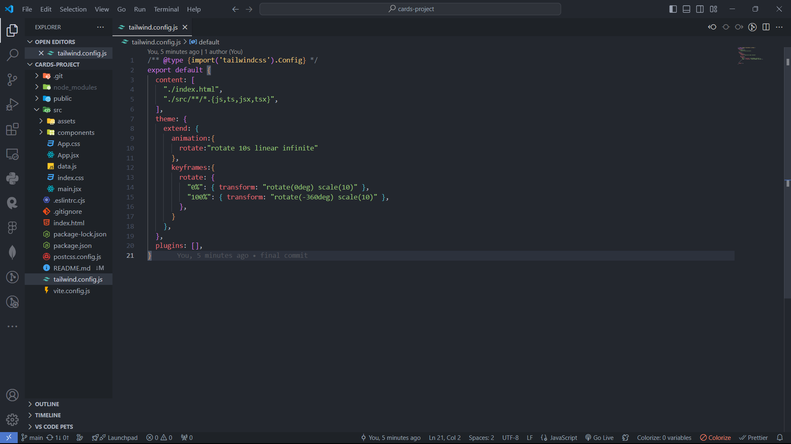
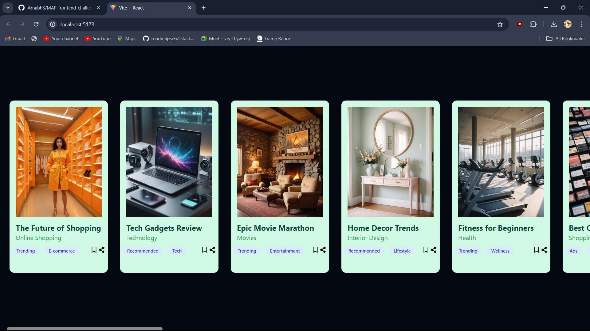

*For Skeleton loader please check the deployed link here*  
Deployment link: <a href="https://verdant-kelpie-273fed.netlify.app/"> Site Link</a>

This project is a React application that displays a horizontal scrollable list of cards. Each card maintains a portrait orientation and includes features like a title, type description, tags, and icons. The cards are displayed in a horizontal order, and the list includes an automatic scrolling effect while allowing user scroll as well. The images in the cards have a border radius for enhanced UI/UX.

Features
Horizontal scrollable list of cards.
Each card includes an image, title, type description, tags, and icons.
Automatic and user-initiated horizontal scrolling.
Hover effects and smooth transitions.
Skeleton loading for images.
Setup and Installation
Follow these steps to set up and run the project locally:

Prerequisites
Node.js (version 14 or higher)
npm (version 6 or higher)
Installation
Clone the repository:

bash
Copy code
git clone https://github.com/ArnabhS/MAP_frontend_challenge_01.git
cd cards-project
Install dependencies:

bash
Copy code
npm install
Run the application:

bash
Copy code
npm start
The application will run in development mode, and you can view it in the browser at http://localhost:3000.

File Structure
src/App.js: Main application component that includes the horizontal scrollable list.
src/components/Cards.js: Card component that displays individual cards with images, titles, descriptions, tags, and icons.
tailwind.config.js: Tailwind CSS configuration file.
Packages Used
React: A JavaScript library for building user interfaces.
Tailwind CSS: A utility-first CSS framework for rapidly building custom user interfaces.
React Icons: A library for including popular icons in your React project.
Tailwind CSS Setup
The project uses Tailwind CSS for styling. Here’s how Tailwind CSS is set up:

Install Tailwind CSS:

bash
Copy code
npm install -D tailwindcss
npx tailwindcss init
Configure Tailwind CSS:

Update the tailwind.config.js file with the paths to your template files:

Copy code

Include Tailwind in your CSS:

Update the src/index.css file to include Tailwind’s base, components, and utilities styles:

Preview:

